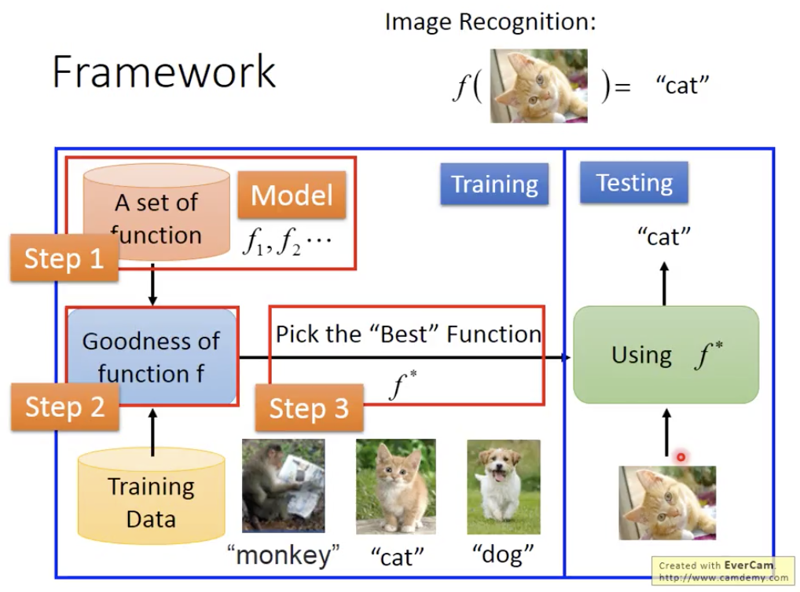
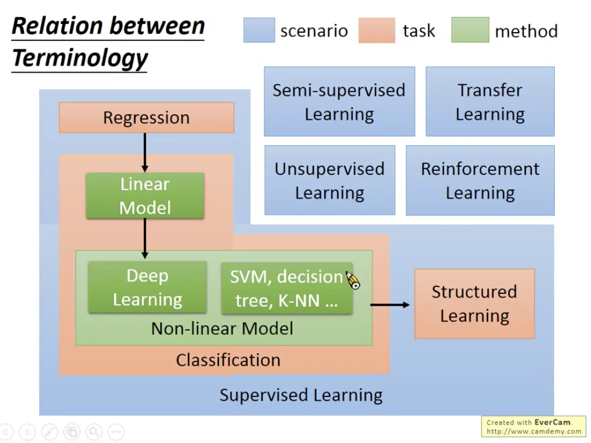

# 【Note】ML0-1 Introduction of Machine Learning
> 根据台大李宏毅教授的机器学习2017课程做笔记；
> 
> [李宏毅教授主页](http://speech.ee.ntu.edu.tw/~tlkagk/index.html)

## P1. Machine Learning ≈ Looking for a function from data

即从数据中学习，并输出函数。以image recognition为例，以函数集为初始模型，这些函数对于输入图像将给出不同的判断结果；提供training data，其中包含图像以及函数在读取图像时应该输出的结果；机器通过train判断初始模型的函数集中函数的优劣。由于函数集中实际由无穷多个函数构成，因此需要有效率的算法，从函数集中挑选出最佳的函数f^*，我们即可使用最佳函数进行测试。上述可归纳为三个步骤：

1. 列出一个函数集(模型)；
2. 训练machine以衡量函数的优劣；
3. 选择算法挑选最佳函数；

## P2. Learning Map
 
### Supervised Learning
Training data：大量包含label的数据；

**分类：**

1. Regression：输出标量(scalar)结果的方法；
2. Classification：
	- 任务：
		- Binary classification：二元分类，输出结果为是否；例如，输入邮件，判断是否为垃圾邮件；
		- Multi-class classification：多元分类，输出结果是类别；例如，输入新闻，输出新闻是那一类；
	- 模型：
		- Linear model；
		- Non-linear model：例如，deep learning，SVM，decision tree， KNN；
3. Structured Learing：输出结构性物件；
	- 例子：
		- Speech Recognition：输入语音输出文字；
		- Machine Translation：输入文字输出翻译；
		- Face Recognition： 输入图像输出人脸对应区域；

### Semi-supervised Learning
Training data：少量包含label的data及大量不包含label的data；

### Transfer Learning
Training data：少量包含label的data及大量可能包含或不包含标签的其他data，其他data可能与当前处理的问题不相关；

### Unsupervised Learning
Training data：大量不包含label的data；

### Reinforcement Learning
v.s. Supervised learning

- **Supervised Learning**：learning from teacher，training data中包含feature及label，即告诉machine在当前feature下应输出何种label；
- **Reinforcement Learning**：learning from critics，training data中包含feture，在训练过程中对machine在当前feature下输出的label进行评价；

*Alpha Go = supervised learning + reinforcement learning*
