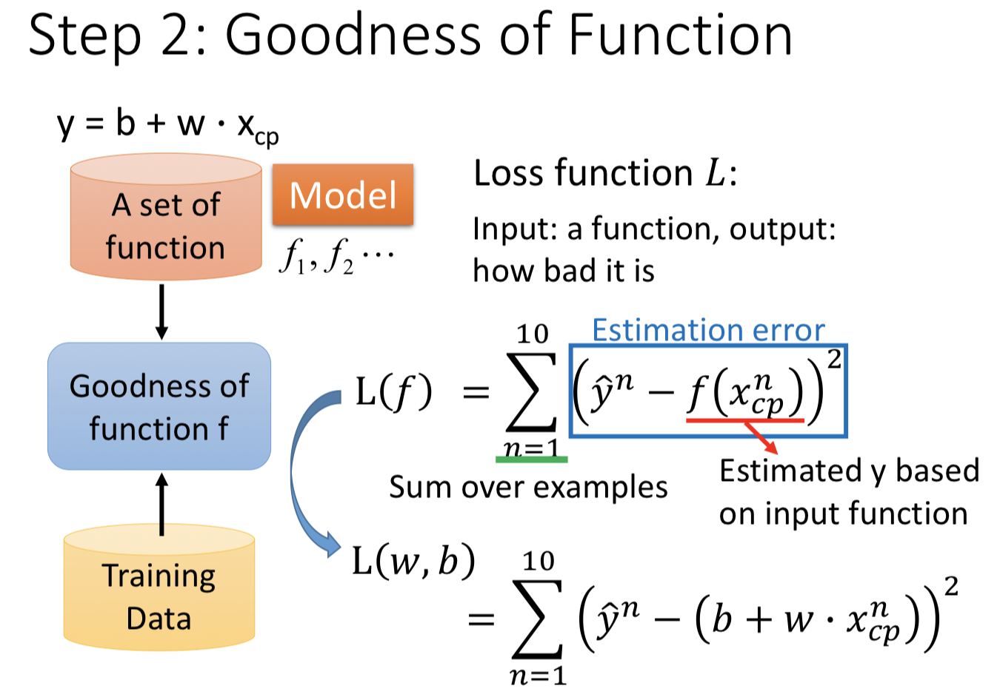
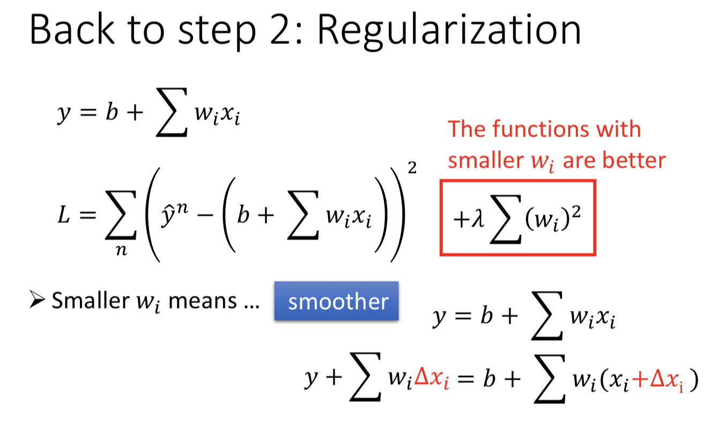
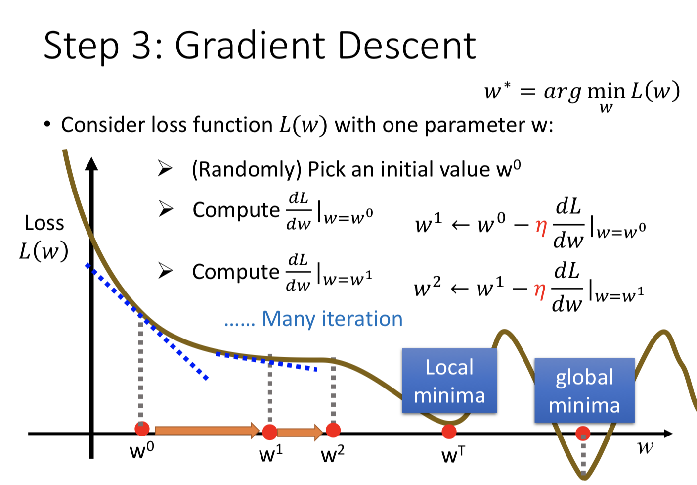
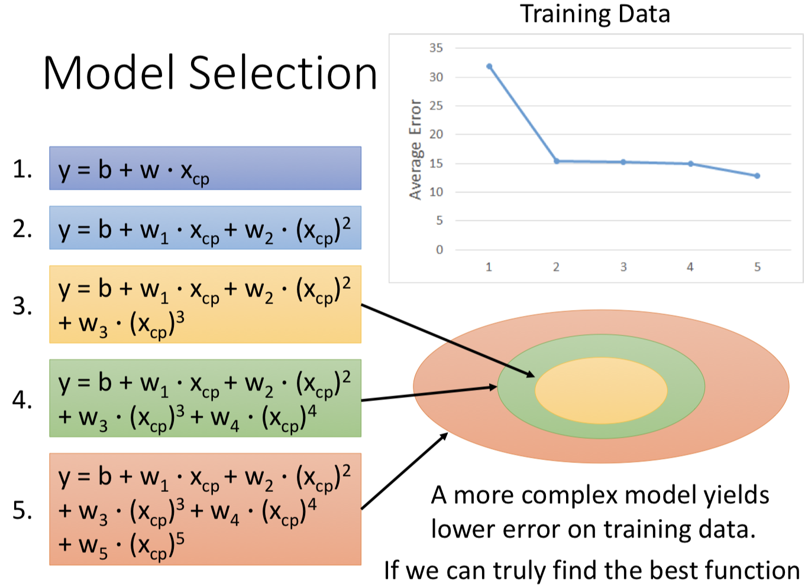

# 【Note】ML1 Regression
> 根据台大李宏毅教授的机器学习2017课程做笔记；
> 
> [李宏毅教授主页](http://speech.ee.ntu.edu.tw/~tlkagk/index.html)

## Regression: Output a scalar
### Step 1: Model
输入feature表示为x，输出结果表示为y，则利用函数建立x与y之间的关系可表示如下：

	y = b + w* x
其中，b、w为参数值，通过设置不同的b和w，我们可以获得不同的函数，故利用不同的b和w可构建一个函数集即模型。模型函数集可表示如下：
	
	f1: y = 10 + 9*x;
	f2: y = 9.8 + 4*x;
	f3: y = -0.5 - 1.2*x;
	...
上述为linear model下仅输入feature x的函数表示，若不止一个feature，则可用x_i，下面是linear model的通用表示形式：

	y = b + sum(w_i * x_i);
- x_i: feature
- w_i: weight
- b: bias

### Step 2: Goodness of Function
在模型中存在不同效果的函数，需要对函数的效果进行评价，因此需要使用training data对machine进行训练。对于训练集中的每个数据，其特征对应一个输出结果。

为评价模型中函数的优劣性，使用Loss function L：

- input：函数；
- output：函数优劣性；

**Regularization**

为了使模型不产生过拟合，可以在Loss function后加入正则项：

	lambda*sum(w_i^2)
通过最小化添加正则项的Loss function，不仅可以获得误差最小，并且可以保证w较小，当w较小时，模型较为平滑，此时即使输入变化较大，也会得到变化较小的结果。我们认为更加平滑的曲线更有可能是正确的。由于b对模型是否平滑不产生影响，因此在正则项中不考虑b。

- 当lambda越大，训练误差越大，而测试误差则会找到一个最小值。这里训练误差越来越大的原因是，在添加正则项之后，需要在原有Loss function的估计误差的基础上考虑正则项的影响，lambda越大，表示估计误差在模型选择中重要性越小。

### Step 3: Best Function/ Gradient Descent
在上述所有可能的函数中，需要找到最优结果的函数，相当于优化问题，即最小化损失函数，使用梯度下降算法，求解最小化损失函数时的w和b参数。

**梯度下降算法无法保证一定获得全局最小结果，可能出现局部最小的情况。**

梯度下降算法：

1. 随机选择初始参数；
2. 计算在初始参数处的微分结果；
3. 根据微分结果调整初始参数并再次计算微分结果；此处对微分结果乘以一个**学习率**，表示参数的变化步长；
4. 当微分结果小于epsilon时，结果收敛；
 

**Note：**

- 在鞍点处或局部最小处会出现微分小于epsilon的情况；但在linear regression情况下，不存在局部最小及鞍点的情况，因此无需担心局部收敛的问题； 

## Model Selection
为提高模型的效果，可以调整模型，若变为n次方程的方程，如：

	y = b + sum(w_i * x_i) + sum(w_i * (x_i)^2);
		
由于此处可将平方项和一次项视作不同的feature，它们与输出关系仍是线性的，因此依旧是linear regression。需要注意，当提高模型次数，会出现过拟合的情况，可通过测试数据发现。

每个模型都是一个函数集，故对于更高次的函数集中包括了低次的函数集。因此对于训练数据，在更高次的模型中找到的最佳函数不会比在低次的模型中找到的更差，故当模型越来越复杂时，训练数据的误差将越来越低，但在测试数据的误差可能会变得非常糟糕。

 