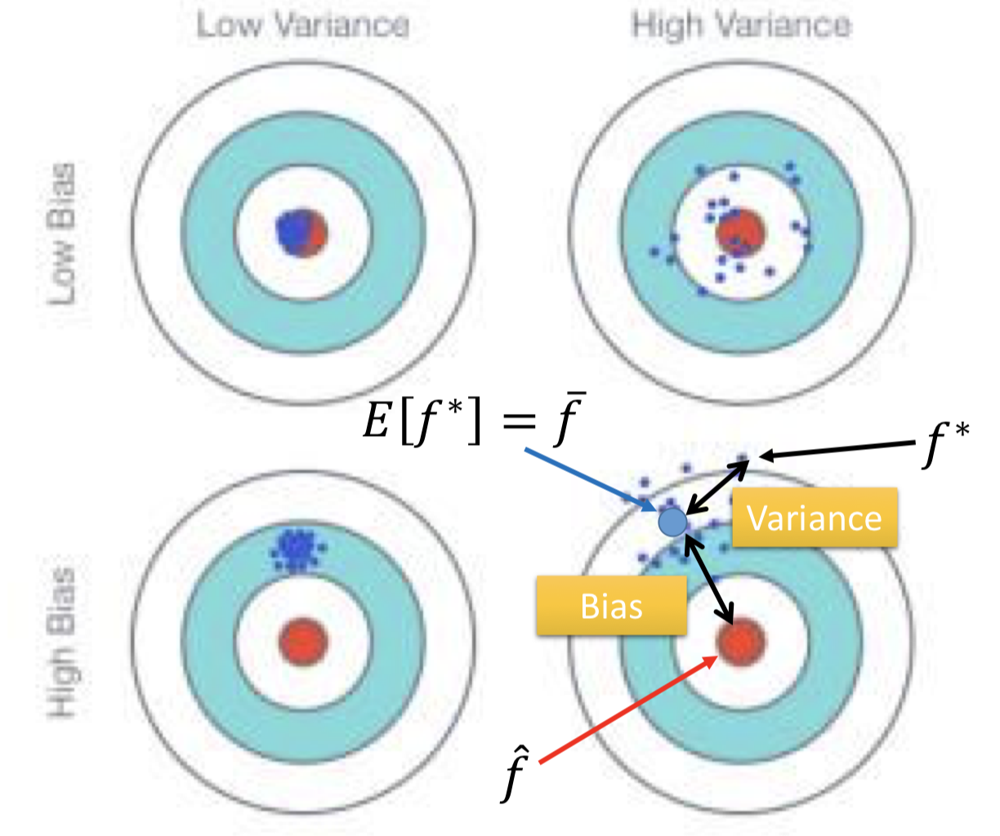
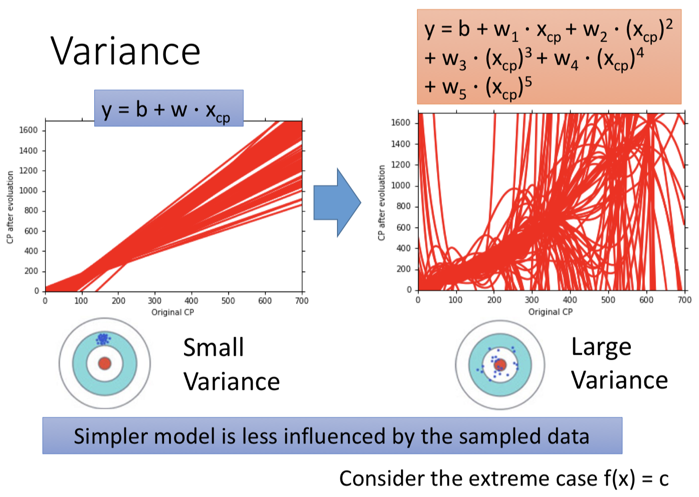
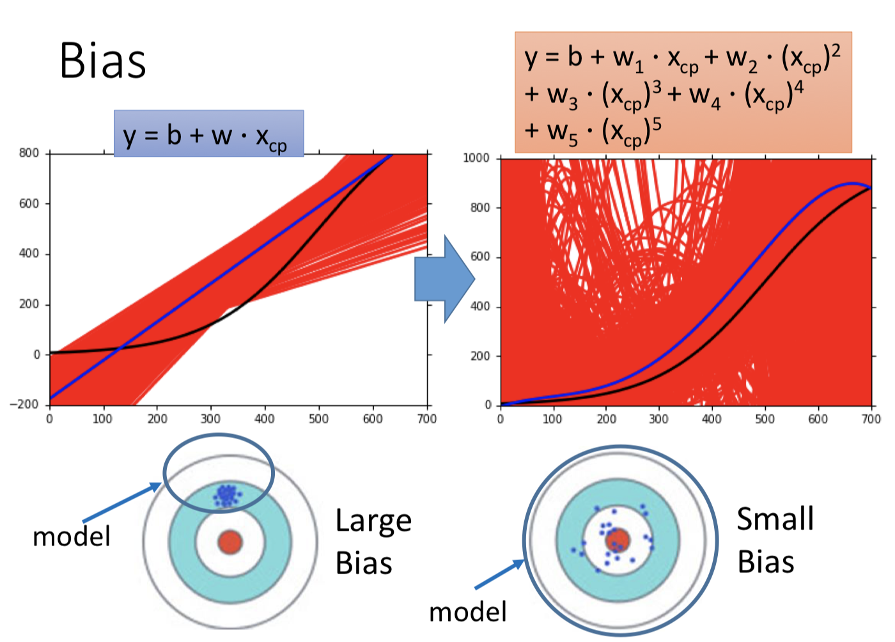
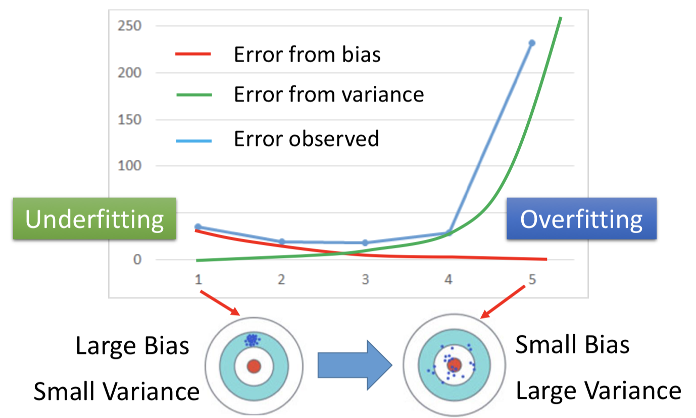
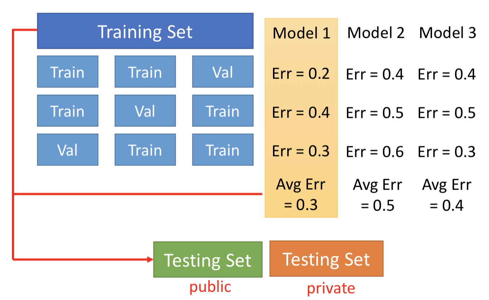

# 【Note】ML2 Where does the error come from? 
> 根据台大李宏毅教授的机器学习2017课程做笔记；
> 
> [李宏毅教授主页](http://speech.ee.ntu.edu.tw/~tlkagk/index.html)

## Estimator
通过输入训练数据，可以确定模型中的最佳函数f\_star，该函数是对实际值f\_hat的estimator。这两个函数之间存在差异，是由bias和variance引起的。可以做以下的理解：

- variance是f\_star与函数集均值函数f\_bar的差异；
- bias是函数集均值函数f_bar与实际最优函数f\_hat之间的差异；

**low variance且low bias的情况下模型效果最好。**

### Bias and Variance of estimator
下面假设对模型进行多次实验，即每次使用不同的训练数据让machine进行学习得到最佳函数f_star。

**Variance**

模型较简单时，variance较小，即每次实验得到的最佳函数f_star对数据的处理效果都较为接近。

- 由于简单的模型受训练数据的影响较小，因此得到的最佳函数之间的差异也较小。

**Bias**

模型较简单时，bias较大，即每次实验得到的最佳函数f_star的平均效果与实际f_hat的效果差距较大。

- 由于简单的模型，其函数集表示的范围较小，只能从这个小范围中选取最优函数。但事实上，该函数集包含范围较小，可能并不包含能够解决问题的实际最优函数f\_hat。因此，无论如何在简单模型中选择，得到的结果都与实际最优函数f\_hat存在差异，即bias。

**Bias v.s. Variance**

简单模型：large bias， small variance；

复杂模型：small bias，large variance；

**Overfitting：误差来自variance，即训练模型可以拟合训练数据但在测试数据上误差较大；**

- 增加训练数据：有效，但数据收集困难；
- 正则化：将曲线进行平滑，但此时会影响bias，因为强制选择平滑的曲线，缩小了函数集的范围，相当于增大了bias；

**underfitting：误差来自bias，即训练模型无法拟合训练数据；**

- 对模型添加更多的特征作为输入；
- 设计一个更复杂的模型；

### Model Selection
**Cross Validation**

将**training set**分为**training set**和**validation set**两个部分，使用training set训练出不同的模型结果，利用validation set测试这些模型的效果，并选出最优模型。使用**testing set**对这个最优模型进行测试，此时输出的结果才是该模型在实际情境下的处理效果。

- 此处分别使用validation set和testing set的原因：若不使用validation set，而直接基于testing set在训练模型上的效果选择最优模型，该模型在实际情境下的处理效果误差可能会大于testing set上得到的结果。为了保证最后选择的模型处理效果可满足baseline，故添加validation set；
- 若认为将training set分解为两个部分降低了可训练数据的量，可以在选出最优模型之后，再利用整体的training set，即无分类的数据，再次对模型进行训练；

**N-fold Cross Validation**

将training set分为若干个集合，每次选择其中一个作为validation set，其余作为training set，将训练出的模型在validation set上的误差求均值，选择最优的结果，并在testing set上确定最终结果。

- 此处使用这种测试的方式，是希望避免通过testing set获得结果后，重新对模型进行调整，使得模型能够在testing set上有一个好的结果。实际上此时已经使模型在尽量拟合testing set，会出现testing set上误差较小，而实际情境下误差较大的情况。