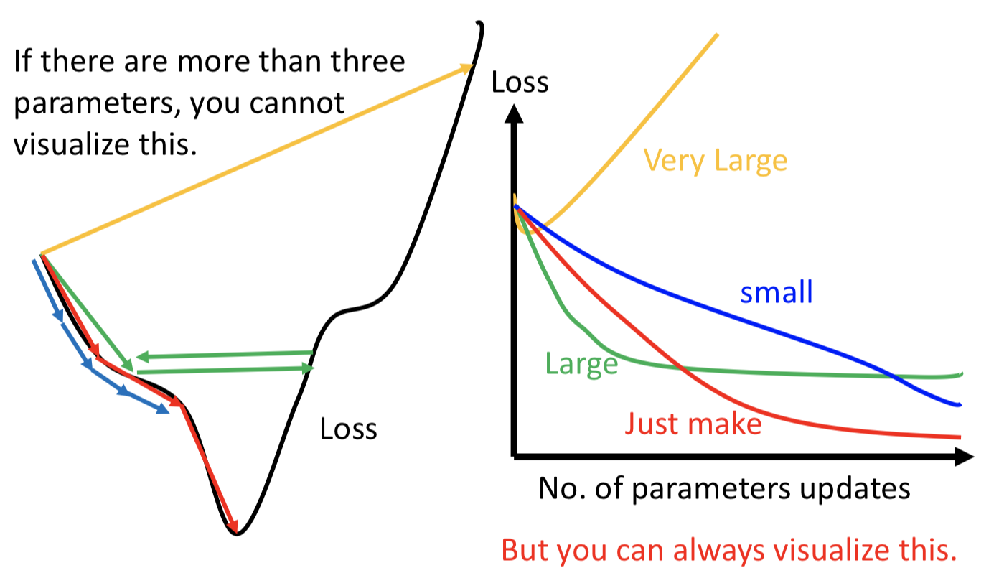
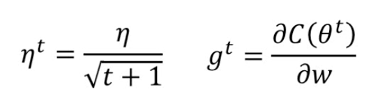
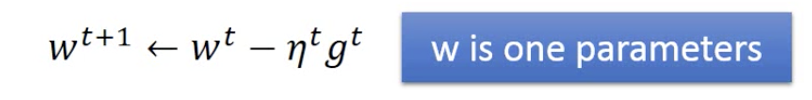
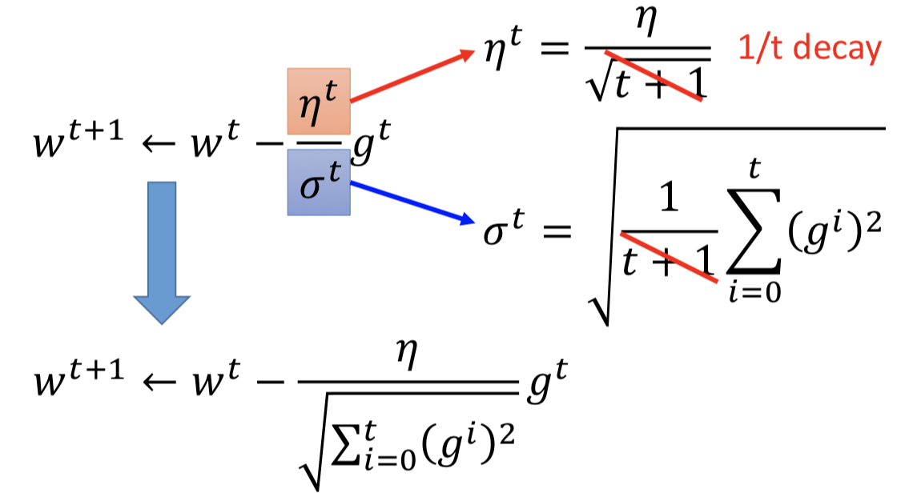
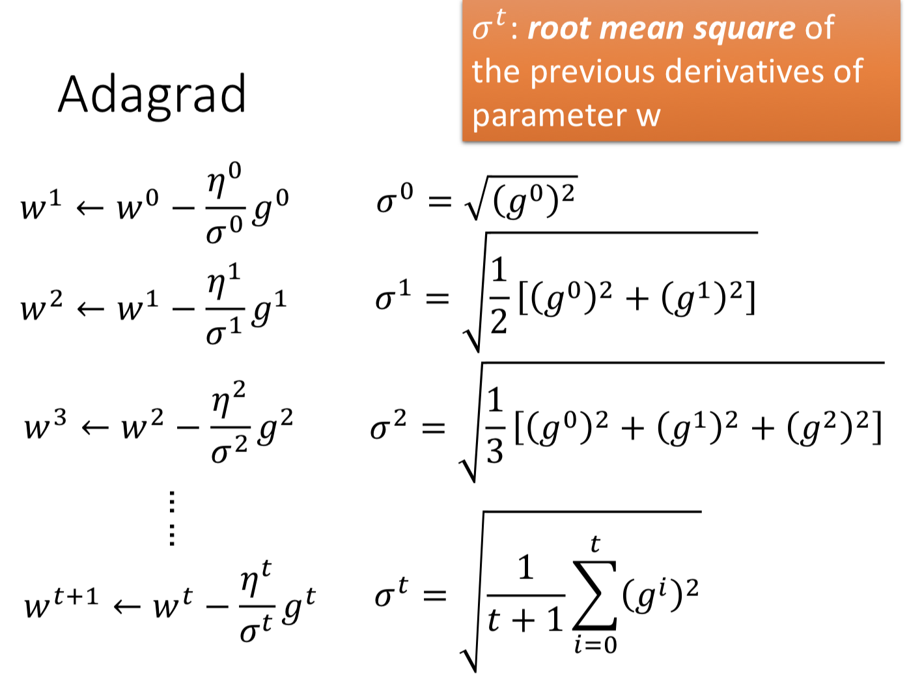
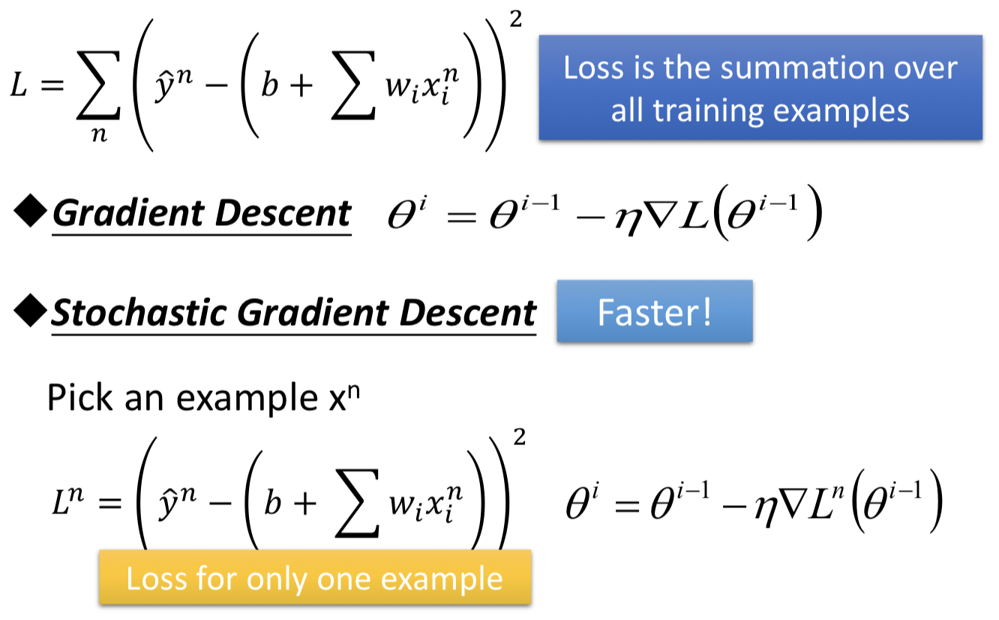
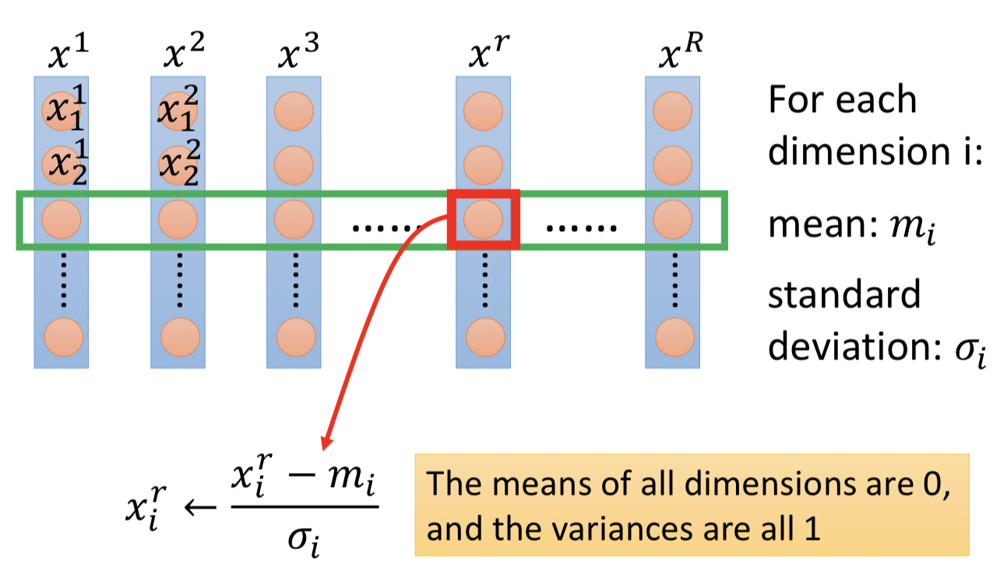
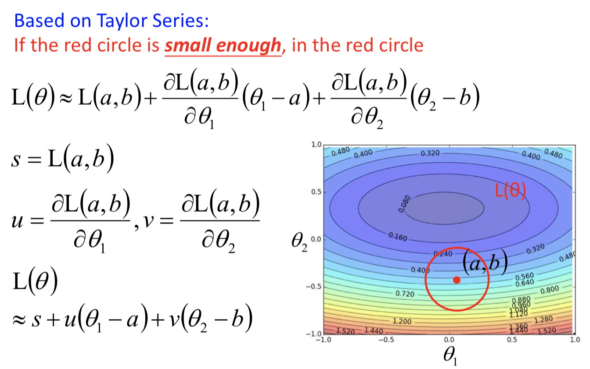
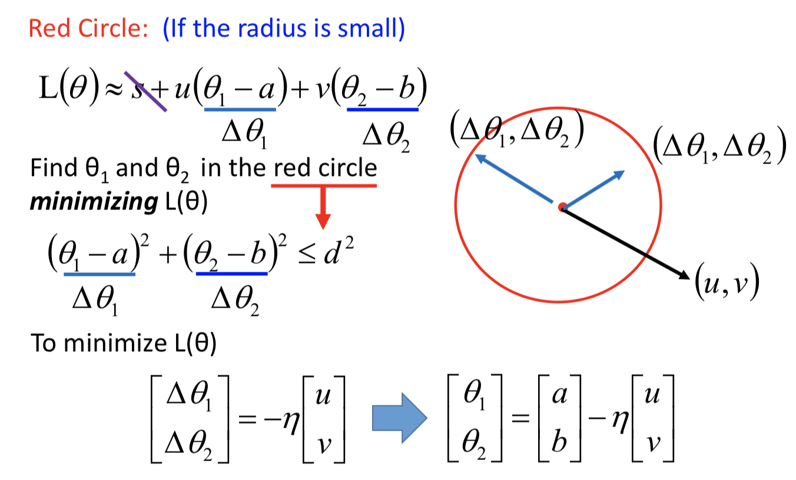
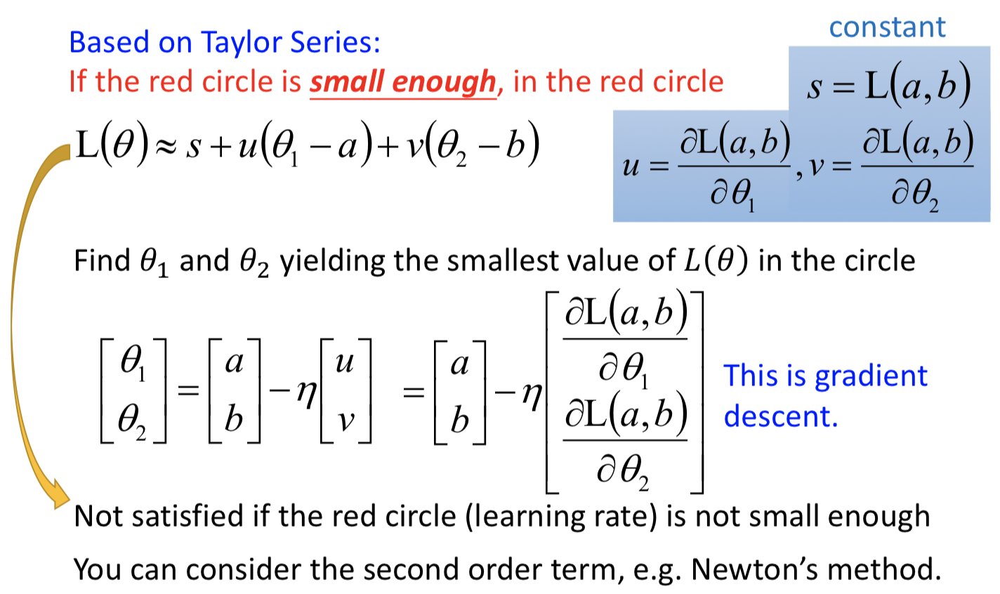

# 【Note】ML3 Gradient Descent
> 根据台大李宏毅教授的机器学习2017课程做笔记；
> 
> [李宏毅教授主页](http://speech.ee.ntu.edu.tw/~tlkagk/index.html)

## Tuning your learning rate
### Learning Rate
可以将Loss与每次更新结果进行绘图表示，确定learning rate是否正确。下图中蓝色表示学习率太小，导致每次优化下降速度过慢；绿色线表示学习率较大，会在同一高度上振荡而无法到达最小处；黄色线表示学习率过大，误差变得无法接受。

### Adaptive Learning Rates
简易方式：随着每次处理，减小学习率；

**Vanilla Gradient descent**

**Adagrad**

e.g.

该方法的参数更新会越来越慢，可以根据需要选择。

- 在Adagra中，梯度项越大，步长越大，则参数变化越大；但当梯度项越大时，delta项也相应越大，则参数变化变小。
- 此处分母中的项表示的是使用一次微分表示二次微分，即对一次微分在不同情况下的值采样求和并取均值，当值较大时表示二次微分的值较大，值较小时二次微分的值较小。

### Stochastic Gradient Descent
帮助加快训练速度。在计算Loss function时，通过计算所有的训练集样本进行计算。但在stochastic梯度下降中，选择随机选择一个样本计算该样本的Loss function，更新参数时，仅考虑该样本对应的参数。

- 普通梯度下降：一次参数更新使用所有的样本，故只进行一次梯度下降；
- stochastic梯度下降：每一个样本进行一次梯度下降，则有多少样本即可进行多少次梯度下降；

### Feature Scaling
即将所有不同特征的尺度调整为一致。若不同特征的尺度不同，则值较大的特征在变化时对结果的影响较大，而值较小的特征在变化时对结果的影响较小。

**常见方式**

对训练集中的表示同一特征的值求均值和均方差，实现正态标准化。

## Gradient Descent Theory
在某个给定参数点的极小范围内，可以使用泰勒级数近似描述Loss function，可以推断出梯度下降的公式，如下图：

由上述可知，为了使Loss function最小化，应该保证将学习率与微分结果相乘后，与小圆半径成比例。同时，由于泰勒级数近似表示loss function需要在极小范围内才可成立，因此需要学习率不能设置过大，当设置过大时，会出现泰勒级数无法近似表示的情况，即此时梯度下降方向并不是使loss function最小的方向。