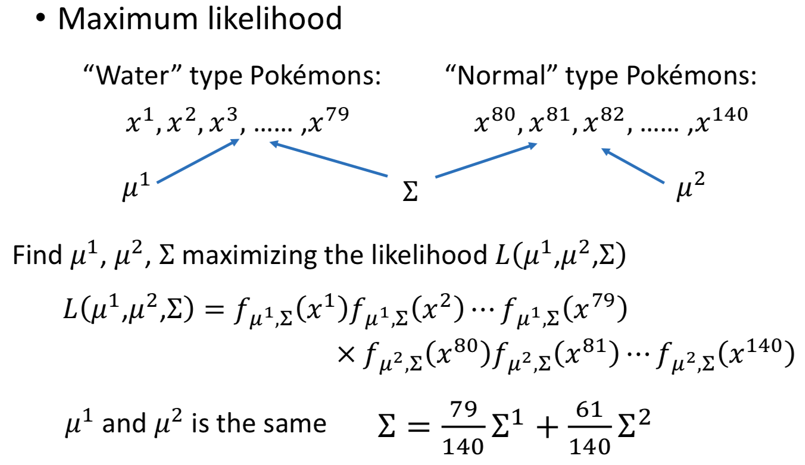

# 【Note】ML4 Classification: Probabilistic Generative Model

> 根据台大李宏毅教授的机器学习2017课程做笔记；
> 
> [李宏毅教授主页](http://speech.ee.ntu.edu.tw/~tlkagk/index.html)
> 
> 2018.04.24

## Classification
### Two Classes

考虑二元分类问题，P(C1)、P(C2)表示从两个类中抽取样本的概率；P(x|C1)、P(x|C2)表示从两个类中抽中样本x的概率；则可计算出抽中样本x属于C1的概率。在二元分类中，当该概率越大，则表示属于该类的可能性越高。上述四个概率从训练集中估计。

#### Prior
计算P(C1)、P(C2)的概率：
	
将训练集划分为training data和validation data，并统计training data中属于两个类的样本各有多少，则可计算得到P(C1)、P(C2)。

#### Probability from Class-Feature
每个样本由一组特征向量表示，假设这些样本是由高斯分布中采样获得的，该高斯分布由均值和协方差确定。确定高斯分布的方法是计算能使likelihood最大的均值和协方差。

#### Results
上述模型的结果并不理想，与多种原因有关。

### Modifying Model
对模型进行调整，在描述不同样本点的高斯模型中，特意选择相同的covariance matrix对其高斯模型进行建模，使模型参数较少。使用相同的covariance matrix时模型将变为线性模型。

### Model Three Steps
1. Function Set (Model)：

	在这里的function set就是由class probability和class probability distribution为模型参数构成的不同function，即选择高斯分布下不同的mean和covariance matrix。
2. Goodness of a function：
	
	评价函数集中不同函数的优劣，通过比较likelihood实现，能最大化likelihood的mean和covariance所构成的function，即为最佳的function。
3. Find the best function

### Probability Distribution
这里的模型不只限于高斯模型，可以根据自己选择合适的概率模型。
- 对于binary feature，则可认为模型分布服从Bernoulli分布；
- 假设所有维度特征都independent，则可以使用Naive Bayes Classifier；

### Posterior Probability

使用高斯分布对z进行计算，可以得到下图中的关系，又由于通常假设covariance相同，因此可对公式进一步简化，最后得到的结果一项与x有关，另一项是一个标量与x无关，将前者视为w，后者视为b，则z可表示为与x线性相关的表达式。故当共用covariance时，分类的boundary是一个线性的分界。

我们可以通过mean和covariance计算得到w和b的值，但是实际上如果直接得到w和b就可计算出对应的结果。因此需要考虑直接计算w和b的方式。